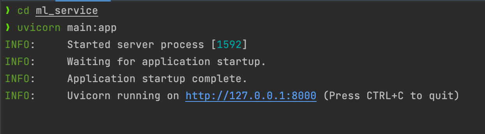
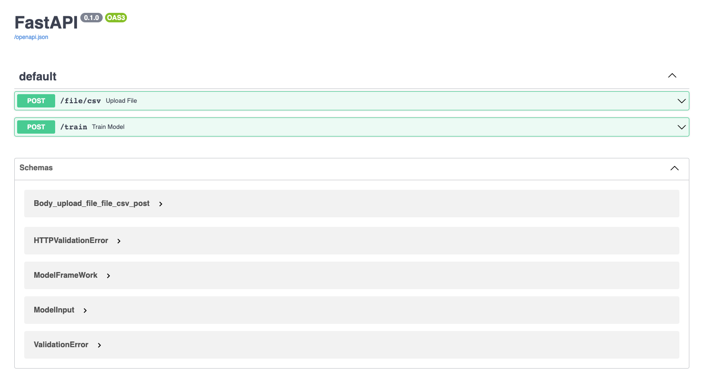

# ml-service
A Machine Learning (ML) Service

# Getting Started
1. Create an virtual environment for Python 3.9
2. Install dependencies
    ```commandline
    pip install -r requirements.txt
    ```
3. Kick-start the app
   ```commandline
   cd ml_service
   uvicorn main:app
   ```
   You should see something like this
   

4. Goto the `/docs` endpoint - http://127.0.0.1:8000/docs to try out the APIs
